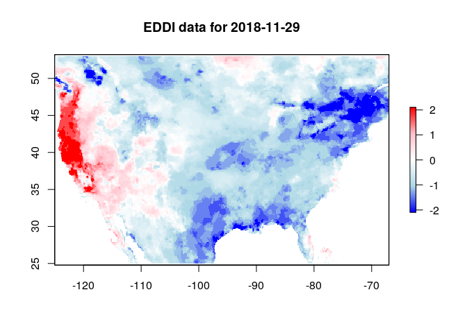

<!-- README.md is generated from README.Rmd. Please edit that file -->

# eddi: R package for the NOAA Evaporative Demand Drought Index

[](https://circleci.com/gh/earthlab/eddi/tree/master)
[](https://ci.appveyor.com/project/earthlab/eddi)
[](https://codecov.io/gh/earthlab/eddi)
[](https://www.repostatus.org/#active)

The eddi R package facilitates access to the NOAA [Evaporative Demand
Drought Index](https://www.esrl.noaa.gov/psd/eddi/) (EDDI) data product.

## Installation

You can install the development version of eddi with devtools:

``` r
# install.packages("devtools")
devtools::install_github("earthlab/eddi")
```

## Example

The EDDI product exists for multiple timescales, including the 1 to 12
week and 1 to 12 months scales. Shorter time scales can detect short
term droughts, e.g., “flash droughts”, and longer time scales are
appropriate for detecting long term drought. For more information see
<https://www.esrl.noaa.gov/psd/eddi/>.

This is a basic example which shows you how to get EDDI data for Nov 29,
2018 at the one month timescale:

``` r
library(eddi)

eddi_data <- get_eddi(date = "2018-11-29", timescale = "1 month")
eddi_data
#> class      : RasterStack 
#> dimensions : 224, 464, 103936, 1  (nrow, ncol, ncell, nlayers)
#> resolution : 0.125, 0.125  (x, y)
#> extent     : -125, -67, 25, 53  (xmin, xmax, ymin, ymax)
#> crs        : +init=epsg:4326 +proj=longlat +datum=WGS84 +no_defs +ellps=WGS84 +towgs84=0,0,0 
#> names      : EDDI_ETrs_01mn_20181129
```

This will always return a `RasterStack` object with each layer in the
stack corresponding to a date, that can be visualized using
`raster::plot`. Here, large positive values indicate exceptionally dry
conditions, and large negative values indicate exceptionally wet
conditions, with values of 0 indicating median EDDI
values.

``` r
color_pal <- colorRampPalette(c("blue", "lightblue", "white", "pink", "red"))
raster::plot(eddi_data, col = color_pal(255), main = "EDDI data for 2018-11-29")
```



## EDDI Resources

A user guide for EDDI can be found here:
<https://www.esrl.noaa.gov/psd/eddi/pdf/EDDI_UserGuide_v1.0.pdf>

For the science behind EDDI, see these two papers:

  - M. Hobbins, A. Wood, D. McEvoy, J. Huntington, C. Morton, M.
    Anderson, and C. Hain (June 2016): The Evaporative Demand Drought
    Index: Part I – Linking Drought Evolution to Variations in
    Evaporative Demand. J. Hydrometeor., 17(6), 1745-1761.  
  - D. J. McEvoy, J. L. Huntington, M. T. Hobbins, A. Wood, C. Morton,
    M. Anderson, and C. Hain (June 2016): The Evaporative Demand Drought
    Index: Part II – CONUS-wide Assessment Against Common Drought
    Indicators. J. Hydrometeor., 17(6), 1763-1779.
